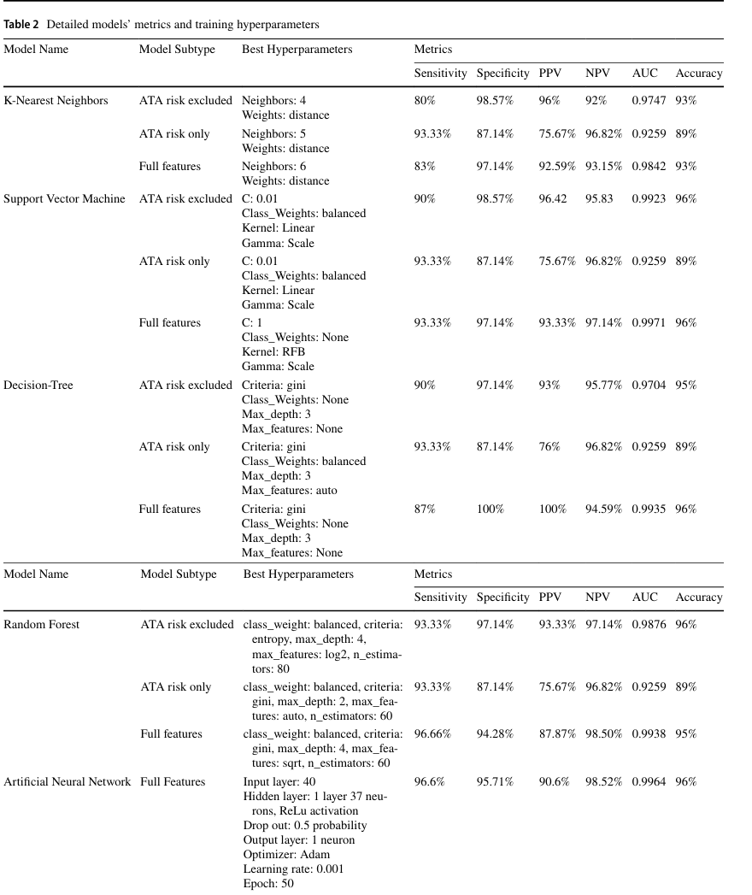

```{r setup, include=FALSE}
knitr::opts_chunk$set(
  echo = TRUE,
  dev  = "svg"
)
```

## Data Description and Exploratory Data Analysis

```{r cars}
dat <- read.csv("Thyroid_Diff.csv")
```

The dataset represents a clinical cohort of thyroid cancer patients. It contains a mixture of demographic, clinical, pathological, and staging variables. All variables are categorical except for age. The outcome variable (Recurred) is a binary indicator of whether the patient experienced disease recurrence.

```{r}
summary(as.factor(dat$Recurred))
```

The demographic variables include Age and Gender. The Age variable (in integer) represents patient age at diagnosis. The Gender variable is binary (F/M).

The dataset consists of 383 observations and 17 variables with no missingness.

```{r}
dim(dat)
summary(as.factor(dat$Gender))
summary(dat$Age)
```

The behavioral and exposure features include Smoking, History of Smoking, and History of Radiotherapy. All are binary variables with values yes or no.

```{r}
summary(as.factor(dat$Smoking))
summary(as.factor(dat$Hx.Smoking))
```

The clinical examination features include Physical Examination, Thyroid Function, and Adenopathy.

The Physical Examination variable is a categorical measure of thyroid examination findings, including diffuse goiter, multinodular goiter, normal exams, and single nodular goiters on either the left or right side. Diffuse goiter refers to a uniformly enlarged thyroid. Multinodular goiter means the thyroid contains many small lumps. Single nodular goiter indicates the presence of one lump on either the left or right side. Lastly, "normal" means no abnormal findings were detected.

```{r}
summary(as.factor(dat$Physical.Examination))
```

The Thyroid Function variable is a categorical measure of the patient’s thyroid hormone status. The categories include euthyroid (normal hormone levels), clinical hypothyroidism (the thyroid is underactive and hormone levels are low), subclinical hypothyroidism (mild early-stage underactivity detectable only on blood tests), clinical hyperthyroidism (the thyroid is overactive and hormone levels are high), and subclinical hyperthyroidism (a mild early-stage form of overactivity detected on tests but often without symptoms).

```{r}
summary(as.factor(dat$Thyroid.Function))
```

The Adenopathy variable is a categorical indicator of abnormal lymph nodes, with categories such as “No” (no enlarged nodes), “Right” or “Left” (swelling on one side of the neck), “Posterior” (swelling in the back of the neck), and “Bilateral Extensive” (enlarged lymph nodes on both sides, indicating more widespread involvement).

```{r}
summary(as.factor(dat$Adenopathy))
```

The pathology features include Pathology and Focalty variables.

Pathology is a categorical variable about the tumor’s microscopic subtype. The categories include papillary (the most common form), follicular (a slower-growing variant), Hurthle cell (a rarer variant with distinctive cell features), and micropapillary (a small-pattern variant).

```{r}
summary(as.factor(dat$Pathology))
```

Focality is a categorical variable indicating whether the cancer appears as a single tumor (unifocal) or multiple separate tumors within the thyroid (multifocal). Multifocal disease generally associated with a higher risk of recurrence.

```{r}
summary(as.factor(dat$Focality))
```

The cancer staging variables follow the TNM system. T is a categorical variable representing the primary tumor’s size. Higher T categories indicating more advanced local disease. N is a categorical measure of whether the cancer has spread to regional lymph nodes. It is a key determinant of recurrence risk. M is a categorical indicator of distant metastasis, distinguishing between patients with no spread beyond the neck (M0) and the rare cases with distant involvement (M1). Stage is a composite categorical variable that summarizes overall disease severity (e.g., Stage I–IV) and is derived from the combined information in T, N, and M.

Because Stage is constructed directly from the T, N, and M components, it inherently contains the same information encoded in those three variables. As a result, Stage is highly correlated with T, N, and M.

```{r}
summary(as.factor(dat$T))
summary(as.factor(dat$N))
summary(as.factor(dat$M))
summary(as.factor(dat$Stage))
```

```{r, warning=FALSE, message=FALSE}
library(tidyr)
library(ggplot2)
library(dplyr)
library(forcats)

stage_prop_long <- function(data, var_name) {
  data %>%
    count(Stage, !!sym(var_name)) %>%
    group_by(!!sym(var_name)) %>%
    mutate(prop = n / sum(n)) %>%
    ungroup() %>%
    rename(level = !!sym(var_name)) %>%
    mutate(var = var_name)
}

stage_tnm <- bind_rows(
  stage_prop_long(dat, "T"),
  stage_prop_long(dat, "N"),
  stage_prop_long(dat, "M")
) %>%
  mutate(
    Stage = fct_relevel(Stage, "I", "II", "III", "IVA", "IVB"),
    var   = factor(var, levels = c("T","N","M"))
  )

ggplot(stage_tnm, aes(x = level, y = Stage, fill = prop)) +
  geom_tile(color = "white") +
  scale_fill_gradient(
    name = "Proportion\nwithin level",
    low  = "white",
    high = "navy"
  ) +
  facet_wrap(~ var, nrow = 1, scales = "free_x",
             labeller = as_labeller(c(T = "T (tumor)", 
                                      N = "N (nodes)",
                                      M = "M (metastasis)"))) +
  labs(
    x = NULL,
    y = "Stage",
    title = "Distribution of Stage within T, N and M"
  ) +
  theme_minimal(base_size = 12) +
  theme(
    panel.grid = element_blank(),
    axis.text.x = element_text(angle = 45, hjust = 1),
    strip.text  = element_text(face = "bold"),
    plot.title  = element_text(hjust = 0.5, face = "bold")
  )


```

The heatmap further shows that Stage is largely determined by the TNM components. Lower T categories (T1a, T1b, T2) are mostly classified as Stage I, while higher T categories tend to map to higher stages. A similar pattern appears for nodal status. N0 cases cluster in Stages I–II, while N1 disease shifts patients upward into Stages II–IV. Metastasis (M) shows the strongest pattern. M0 patients predominantly fall within Stages I–III, while most M1 cases are classified into the highest stage group.

As a result, later in the logistic regression analysis, TNM components will not be included in the models. Stage variable will be incorporated into the model as the only cancer staging variable.

The Response variable describers how well the patient responded to treatment. It has four categories: Excellent (no disease), Indeterminate (uncertain findings), Biochemical Incomplete (abnormal labs), and Structural Incomplete (visible persistent disease). Lastly, the Risk variable is derived from the American Thyroid Association (ATA) Risk Stratification System. This system classifies patients into Low, Intermediate, or High risk of recurrence based on specific pathological and clinical features.

```{r}
summary(as.factor(dat$Response))
summary(as.factor(dat$Risk))
```

```{r, warning=FALSE, message=FALSE}
library(DescTools)

vars_to_check <- c("Pathology", "Focality", "T", "N", "M", "Stage")

cramers_results <- sapply(vars_to_check, function(v) {
  CramerV(dat[[v]], dat$Risk)
})

cramers_results
```

Since Risk is also a derived variable, it is suspected that it provides overlapping information with other variables in the dataset. So, a Cramer's V analysis is performed to investigate the association between Risk and other variables. It shows that Risk is strongly associated with T (0.70), M (0.65), N (0.53), and overall Stage (0.57). Moderate association with Focality (0.46) and weaker association with Pathology (0.20) further confirm that Risk functions as a composite summary of multiple clinical features rather than an independent predictor.

The dataset comes from a clinical journal study that compared machine learning model performance but did not conduct any statistical inference. A primary goal of this project is therefore to carry out an inference-focused analysis to answer the question: which clinical predictors are meaningfully associated with thyroid cancer recurrence after adjusting for other factors? 

## Multiple Correspondence Analysis

Because the dataset contains many multi-level categorical variables, it is helpful to first examine their joint structure rather than treating each variable in isolation. Multiple correspondence analysis (MCA) provides an overview of how patients cluster based on their clinical and pathological profiles and whether recurrence status aligns with any multivariate pattern. This exploratory step offers a compact way to visualize relationships across predictors at the outset of the analysis.

```{r, warning=FALSE, message=FALSE}
library(FactoMineR)
library(factoextra)

dat$Recurred <- factor(dat$Recurred)

dat_mca <- dat %>% select(-Age)
res_mca <- MCA(dat_mca, graph = FALSE)

p <- fviz_mca_ind(
  res_mca,
  label = "none",
  habillage = dat$Recurred,
  addEllipses = TRUE,
  palette = c("#1f78b4", "#e31a1c")
)

p + 
  geom_text(
    aes(label = dat$Age),
    size = 3,
    vjust = -0.6,
    check_overlap = TRUE
  ) +
  ggtitle("MCA of Clinical Variables with Age Labels")


```

The MCA plot shows that the data form two clusters corresponding to two recurrence status, but the separation is not clean. It is also noteworthy that the two groups overlap in the region of patients in their twenties to forties. This indicates that younger individuals exhibit more heterogeneous clinical–pathological profiles. This overlap also implies that age alone is not the primary driver of separation.

Although MCA is not an inferential method, it provides an initial exploratory view of how patients distribute across the multivariate space of categorical clinical variables. The partial overlap between recurrence groups seen in the MCA plot supports the need for adjusted regression models to identify independent predictors.

## Logistic Regression Analysis

Given the binary outcome and the moderate number of candidate predictors (≤16), logistic regression provides an appropriate modeling framework for identifying factors associated with thyroid cancer recurrence. To determine a parsimonious set of explanatory variables, we applied stepwise selection based on the Akaike Information Criterion (AIC).

```{r, include=FALSE}
dat$Recurred <- relevel(dat$Recurred, ref = "No")

fit_full <- glm(Recurred ~ ., data = dat, family = binomial)
fit_step <- step(fit_full, direction = "both")

```

```{r}
summary(fit_step)
```

The stepwise procedure selected a model that includes age, pathology, ATA-defined risk, and response as predictors. Several pathology subtypes and treatment response categories show meaningful associations with recurrence. However, the extremely large standard errors for some coefficients (e.g., Micropapillary pathology and Low risk) indicate quasi-separation or near–complete separation in the data. This is expected given the relatively small sample size and the fact that some categories exhibit very few recurrence events.

Because quasi-separation leads to unstable maximum likelihood estimates, standard logistic regression is not reliable for inference in this setting. To address this issue and obtain valid parameter estimates, Firth’s penalized likelihood logistic regression was performed. Firth's penalized logistic regression is designed specifically to mitigate separation problems and produce more stable inference.

```{r, warning=FALSE, message=FALSE}
library(logistf)

fit_firth_final <- logistf(Recurred ~ Age + Pathology + Risk + Response, data = dat)
summary(fit_firth_final)
```

```{r, warning=FALSE, message=FALSE, fig.width=10, fig.height=5}
library(forcats)

make_or_table <- function(fit) {
  data.frame(
    Variable = names(fit$coef),
    OR       = exp(fit$coef),
    LowerCI  = exp(fit$ci.lower),
    UpperCI  = exp(fit$ci.upper)
  ) |>
    dplyr::filter(Variable != "(Intercept)")
}

or_final <- make_or_table(fit_firth_final)

or_final_plot <- or_final %>%
  mutate(Variable = fct_rev(Variable))

ggplot(or_final_plot, 
       aes(x = Variable, y = OR, ymin = LowerCI, ymax = UpperCI)) +
  geom_pointrange(color = "navy", size = 0.7) +
  geom_hline(yintercept = 1, linetype = "dashed", color = "gray40") +
  scale_y_log10() +
  labs(
    title = "Adjusted Odds Ratios (Firth Logistic Regression)",
    x = NULL,
    y = "Odds Ratio (log scale)"
  ) +
  theme_minimal(base_size = 13) +
  theme(
    plot.margin = margin(20, 20, 30, 20),
    panel.grid.minor = element_blank(),
    axis.text.y = element_text(size = 11),
    plot.title = element_text(hjust = 0.5, face = "bold")
  ) +
  coord_flip()

```

The Firth logistic regression identifies several statistically significant associations with thyroid cancer recurrence. Structural incomplete response shows the strongest effect with an odds ratio far above 1. Excellent response is also significant and associated with lower recurrence risk. Among the pathology subtypes, Hurthle cell carcinoma shows a statistically significant reduction in recurrence risk. For ATA-defined risk groups, the Low-risk category also demonstrates a statistically significant protective effect. Age shows a positive trend but is marginally significant, and the remaining predictors have confidence intervals that cross 1, which indicates no statistically reliable associations. Overall, the significant findings highlight strong effects from treatment response and meaningful protective associations for Hurthle cell pathology and ATA low-risk classification.

## XGBoost Model Training

As a supplement to the original study, we trained an XGBoost model on this dataset to evaluate its performance, since the published analysis did not include it. Given XGBoost’s superior performance on classfication and regression tasks on tabular data, incorporating it provides a more complete comparison of modern predictive methods.

```{r, warning=FALSE, message=FALSE}

library(recipes)

rec <- recipe(Recurred ~ ., data = dat) %>%
  step_dummy(all_nominal_predictors(), one_hot = TRUE) %>%
  step_zv(all_predictors())

encoded_data <- rec %>%
  prep() %>%
  bake(new_data = NULL)

```

First, feature space was one-hot encoded.

```{r, warning=FALSE, message=FALSE}
set.seed(2025)
library(caret)

train_index <- createDataPartition(encoded_data$Recurred, p = 0.8, list = FALSE)

train_data <- encoded_data[train_index, ]
test_data  <- encoded_data[-train_index, ]

```

Then, a 80:20 train-test split was performed. 

```{r, warning=FALSE, message=FALSE}

library(xgboost)

train_matrix <- xgb.DMatrix(
  data = as.matrix(select(train_data, -Recurred)),
  label = as.numeric(train_data$Recurred) - 1
)

test_matrix <- xgb.DMatrix(
  data = as.matrix(select(test_data, -Recurred)),
  label = as.numeric(test_data$Recurred) - 1
)

params_baseline <- list(
  objective = "binary:logistic",
  eval_metric = "auc",
  eta = 0.1,
  max_depth = 3,
  subsample = 0.8,
  colsample_bytree = 0.8
)

set.seed(2025)
baseline_xgb <- xgb.train(
  params = params_baseline,
  data = train_matrix,
  nrounds = 200,
  watchlist = list(train = train_matrix, test = test_matrix),
  verbose = 0
)

pred_prob <- predict(baseline_xgb, test_matrix)
pred_class <- ifelse(pred_prob > 0.5, 1, 0)


library(pROC)

true_labels <- getinfo(test_matrix, "label")

auc_baseline <- roc(true_labels, pred_prob)$auc
auc_baseline

pred_class <- ifelse(pred_prob > 0.5, 1, 0)

conf_mat <- table(
  truth = true_labels,
  pred  = pred_class
)

conf_mat


```

```{r, warning=FALSE, message=FALSE}

TN <- conf_mat[1, 1]
FP <- conf_mat[1, 2]
FN <- conf_mat[2, 1]
TP <- conf_mat[2, 2]


sensitivity <- TP / (TP + FN)
specificity <- TN / (TN + FP)
PPV <- TP / (TP + FP)
NPV <- TN / (TN + FN)
accuracy <- (TP + TN) / sum(conf_mat)

library(pROC)
AUC <- roc(true_labels, pred_prob)$auc

metrics <- data.frame(
  Sensitivity = round(sensitivity, 4),
  Specificity = round(specificity, 4),
  PPV = round(PPV, 4),
  NPV = round(NPV, 4),
  AUC = round(AUC, 4),
  Accuracy = round(accuracy, 4)
)

metrics

```



XGBoost model performs at the top of the range reported in the paper. Its sensitivity and specificity are both around 95–96%, which matches or exceeds the best models in the paper, including random forest and neural networks. The PPV and NPV are strong, and the AUC of 0.998 is higher than any value reported in the table. The accuracy is also in line with the strongest models. Overall, XGBoost provides performance that is as good as or better than the models evaluated in the study.


```{r, warning=FALSE, message=FALSE}
library(ROCR)

y_test    <- getinfo(test_matrix, "label")
pred_prob <- predict(baseline_xgb, test_matrix)

pred <- prediction(pred_prob, y_test)
perf <- performance(pred, "tpr", "fpr")

plot(perf,
     col = "darkorange",
     lwd = 3,
     main = "ROC Curve",
     xlab = "False Positive Rate",
     ylab = "True Positive Rate",
     xlim = c(0, 1),
     ylim = c(0, 1))

abline(0, 1, lty = 2, col = "gray")


```


```{r, warning=FALSE, message=FALSE}
importance_matrix <- xgb.importance(model = baseline_xgb)

xgb.plot.importance(importance_matrix,
                    top_n = 20,
                    rel_to_first = TRUE,
                    xlab = "Relative Importance",
                    main = "XGBoost Feature Importance")

```

The XGBoost feature-importance results match the main findings from the Firth logistic regression. Structural incomplete response is the top predictor in both models, and excellent and biochemical incomplete responses also rank high in XGBoost. This is consistent with their significant effects in the regression. 

The ATA low-risk group appears as an important protective feature in both approaches. One difference is that Hurthle cell pathology is significant in the Firth model but receives little weight in XGBoost, suggesting that the tree-based model does not rely on it as much. Overall, both methods highlight treatment response and ATA risk group as the key contributors to recurrence prediction.

## Conclusions and Future Directions

Overall, the analysis shows that treatment response, age, and ATA risk are the main predictors of thyroid cancer recurrence, which is supported by both Firth logistic regression and XGBoost. XGBoost, which was not evaluated in the original paper, already performs at the top range of all models reported, even though the current version is only a baseline model without any hyperparameter tuning. 
Its strong initial performances suggest that it has clear potential for further improvement. Future work can focus on tuning XGBoost parameters and narrowing the feature space to variables that are clinically available and consistently recorded, since the paper notes that not all features can be used in real practice.


